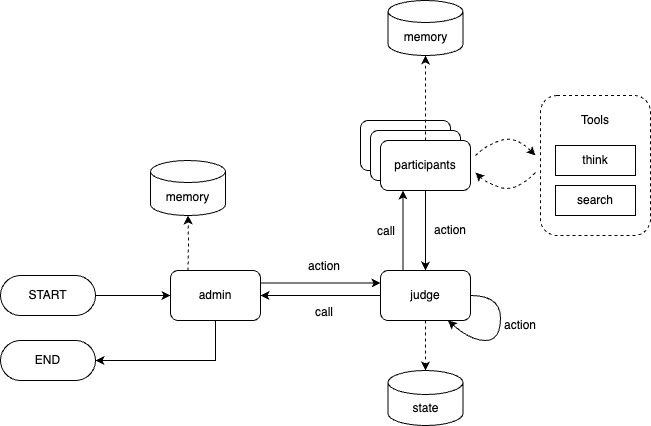

# rule0

Multi-agent deliberation framework.

## Overview

### Nodes

- **admin**:
- **participant**:
- **judge**:

### Tools

- **search**:

### States

- **admin-memory**:
- **participant-memory**:
- **judge-memory**:
- **world-memory**:

### Edges

- **call**:
- **action**:

## Concept

### World

Global state.

### Estoppel

Enforcing consistency in agent behavior.

### Clock

Global clock.
